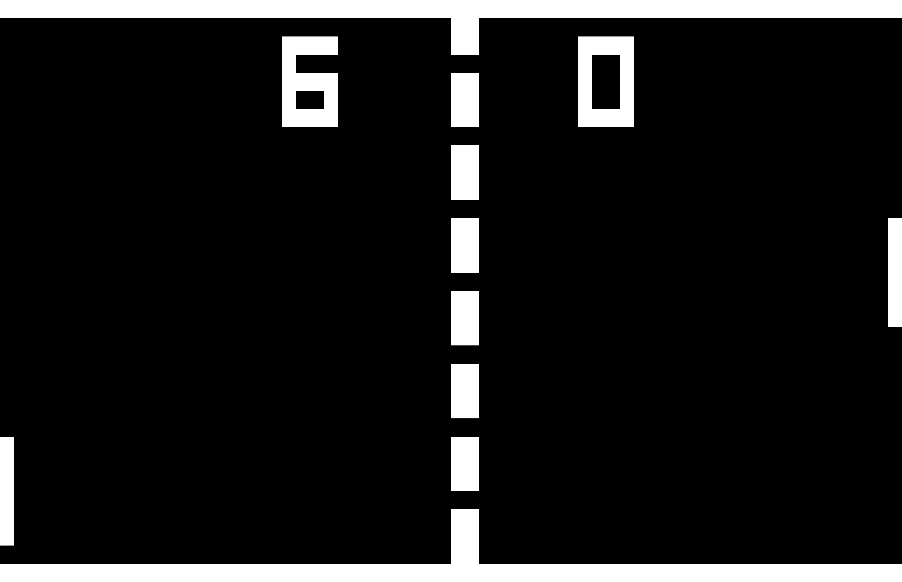
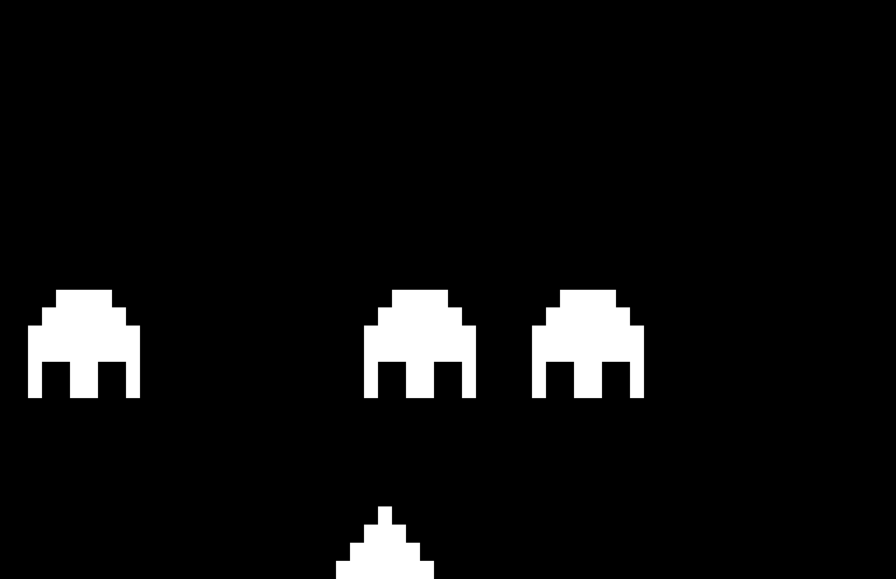

# CHIP-8 Emulator

A CHIP-8 emulator written in **C++20** using **SFML** for graphics, keyboard input, timing, and audio.

The emulator implements the CHIP-8 virtual machine, including its instruction set, 4 KiB memory space, registers, call stack, timers, 64 × 32 monochrome display, hexadecimal keypad, and sound output. CHIP-8 programs are loaded from ROM files and executed at approximately **500 instructions per second**, while the delay and sound timers operate independently at approximately **60 Hz**.

This project was built as an exploration of emulation, virtual-machine architecture, instruction decoding, low-level data representation, and modern C++.

## Screenshots

<p align="center">
  
  &nbsp;
  
</p>

## Features

- C++20 implementation
- Complete CHIP-8 instruction interpreter
- 4 KiB emulated memory
- 16 8-bit general-purpose registers
- 16-level call stack
- 12-bit index register
- 64 × 32 monochrome graphics
- Sprite drawing with XOR collision detection
- 16-key hexadecimal keypad
- 60 Hz delay and sound timers
- 500 Hz instruction execution
- Generated CHIP-8 sound tone
- Pseudorandom number generation using the C++ standard library
- Table-driven opcode dispatch using `std::function`
- Bounds-checked memory and stack access
- Full-screen display through SFML
- CMake build system
- Several public-domain CHIP-8 ROMs included for testing and demonstration

## What is CHIP-8?

CHIP-8 is a small interpreted programming environment originally developed in the 1970s for early microcomputers such as the COSMAC VIP.

Rather than emulating a particular processor, a CHIP-8 emulator implements a simple virtual machine. A conventional CHIP-8 system provides:

- 4,096 bytes of memory
- sixteen 8-bit registers (`V0`–`VF`)
- a 16-bit index register
- a program counter
- a call stack
- delay and sound timers
- a 64 × 32 monochrome display
- a 16-key hexadecimal keypad
- 2-byte instructions

Its small instruction set and well-defined virtual hardware make CHIP-8 useful for exploring the fundamental concepts behind interpreters and emulators without first implementing a complete physical CPU.

## Architecture

The emulator is implemented around a `CHIP8` class that owns the complete state of the virtual machine as well as the SFML resources used to present it.

Conceptually, execution follows the traditional emulator cycle:

```text
        ┌─────────┐
        │  Fetch  │
        └────┬────┘
             │
             ▼
        ┌─────────┐
        │ Decode  │
        └────┬────┘
             │
             ▼
        ┌─────────┐
        │ Execute │
        └────┬────┘
             │
             └──────────► repeat
```

Each cycle retrieves a 16-bit opcode from emulated memory, advances the program counter, decodes the instruction, and dispatches it to the appropriate implementation.

Graphics, input, timers, and sound are maintained alongside this execution loop.

## Virtual Machine State

The emulator models the major components of a CHIP-8 system directly.

### Memory

CHIP-8 provides **4,096 bytes** of addressable memory:

```text
0x000 ┌─────────────────────────┐
      │ Interpreter / Font Data │
      │                         │
0x200 ├─────────────────────────┤
      │                         │
      │      CHIP-8 Program     │
      │         & Data          │
      │                         │
0xFFF └─────────────────────────┘
```

Programs are loaded beginning at address:

```text
0x200
```

which is the conventional starting address for CHIP-8 software.

The built-in hexadecimal font is loaded into low memory before program execution.

### Registers

The virtual machine provides sixteen 8-bit general-purpose registers:

```text
V0 V1 V2 V3 V4 V5 V6 V7
V8 V9 VA VB VC VD VE VF
```

`VF` is also used as a flag register by several arithmetic and graphics instructions, including carry, borrow, and sprite-collision operations.

The emulator additionally maintains:

- program counter (`PC`)
- index register (`I`)
- stack pointer (`SP`)
- delay timer (`DT`)
- sound timer (`ST`)

### Stack

A 16-entry stack stores return addresses for CHIP-8 subroutine calls.

`CALL` pushes the current program counter onto the stack, while `RET` restores the saved address.

## Instruction Fetch and Decode

CHIP-8 instructions are 16 bits wide and stored as two consecutive bytes in memory.

The emulator reconstructs each instruction from memory before decoding it:

```cpp
std::uint16_t opcode =
    (static_cast<std::uint16_t>(memory[PC]) << 8U)
    | static_cast<std::uint16_t>(memory[PC + 1]);
```

CHIP-8 instructions commonly use several encoded fields:

```text
nnn  12-bit address
nn    8-bit immediate value
n     4-bit immediate value
x     V-register index
y     V-register index
```

For example:

```text
6xnn    LD Vx, nn
```

loads the immediate 8-bit value `nn` into register `Vx`.

The emulator uses bit masks and shifts to extract these fields from the instruction word.

## Opcode Dispatch

Rather than implementing instruction decoding as one large `switch` statement, the emulator uses maps of opcode patterns to `std::function` objects.

The upper nibble identifies the primary instruction family:

```text
0x0000
0x1000
0x2000
...
0xF000
```

Instructions requiring additional decoding—particularly the `0`, `8`, `E`, and `F` families—are dispatched through secondary opcode maps.

Conceptually:

```text
            16-bit opcode
                  │
                  ▼
        ┌───────────────────┐
        │ Upper-nibble map  │
        └─────────┬─────────┘
                  │
          ┌───────┴────────┐
          │                │
    direct opcode     opcode family
          │                │
          ▼                ▼
      execute       secondary lookup
                           │
                           ▼
                        execute
```

This separates instruction selection from the implementation of each instruction and keeps the individual opcode handlers focused on virtual-machine behavior.

Unsupported opcode patterns are detected during dispatch and reported with the opcode and memory location.

## Implemented Instructions

The emulator implements the standard CHIP-8 instruction set, including:

| Category | Operations |
| --- | --- |
| Control flow | jump, call, return |
| Conditional execution | register/immediate and register/register skips |
| Register operations | load, add, move |
| Logic | AND, OR, XOR |
| Arithmetic | addition, subtraction, reverse subtraction |
| Bit operations | left and right shifts |
| Memory | register store/load |
| Indexing | load and modify `I` |
| Graphics | clear screen, draw sprite |
| Input | key pressed, key released, wait for key |
| Timers | read/write delay and sound timers |
| Conversion | binary-coded decimal |
| Font | hexadecimal sprite lookup |
| Random | random byte masked by an immediate value |

Each opcode is implemented as a dedicated member function.

## Graphics

CHIP-8 uses a monochrome:

```text
64 × 32 pixel
```

display.

The emulator represents the virtual display with an SFML image and transfers it to an SFML texture for presentation.

CHIP-8 graphics are sprite based. The `Dxyn` instruction draws an `n`-byte sprite stored at the address contained in the `I` register.

Each sprite byte represents eight horizontal pixels:

```text
bit 7                           bit 0
  │                               │
  ▼                               ▼
┌───┬───┬───┬───┬───┬───┬───┬───┐
│ 1 │ 0 │ 1 │ 1 │ 0 │ 0 │ 1 │ 0 │
└───┴───┴───┴───┴───┴───┴───┴───┘
```

Sprites are drawn using XOR semantics. Drawing onto an inactive pixel activates it; drawing onto an active pixel clears it.

When a sprite causes an existing pixel to be cleared, `VF` is set to indicate a collision.

This behavior is implemented directly rather than delegated to a higher-level graphics primitive.

## Timers and Execution Rate

CHIP-8 has two independent 8-bit timers:

- **Delay Timer (`DT`)**
- **Sound Timer (`ST`)**

Both decrement at approximately **60 Hz** while their values are nonzero.

Instruction execution is maintained separately at approximately:

```text
500 Hz
```

or one instruction every:

```text
2 ms
```

This separation models the distinction between the CHIP-8 instruction execution rate and its fixed-rate timers.

## Sound

When the sound timer is nonzero, CHIP-8 produces a tone.

The emulator generates its sound waveform programmatically rather than loading an external audio asset. It creates a looping audio buffer at a **44.1 kHz sample rate** with a tone frequency of approximately **1050 Hz**.

The sound begins when the sound timer is loaded and stops after the timer reaches zero.

## Keyboard

The original CHIP-8 uses a hexadecimal keypad:

```text
1 | 2 | 3 | C
4 | 5 | 6 | D
7 | 8 | 9 | E
A | 0 | B | F
```

This emulator maps that layout onto the left side of a conventional keyboard:

```text
CHIP-8         Keyboard

1  2  3  C     1  2  3  4
4  5  6  D     Q  W  E  R
7  8  9  E     A  S  D  F
A  0  B  F     Z  X  C  V
```

SFML keyboard events update the corresponding state of the emulated hexadecimal keypad.

## Random Number Generation

The CHIP-8 `Cxnn` instruction requires a random byte:

```text
RND Vx, nn
```

The emulator uses the C++ standard random-number facilities:

```cpp
std::default_random_engine
std::uniform_int_distribution<std::uint8_t>
```

to generate values from 0 through 255 before applying the instruction's mask.

This replaces the C-style random-number generation used by the original version of the project.

## Requirements

The project requires:

- A C++20-compatible compiler
- CMake 3.22 or later
- SFML 2.5
- `{fmt}`
- Microsoft Guidelines Support Library (GSL)

SFML components used by the emulator are:

- `system`
- `window`
- `graphics`
- `audio`

## Building

Clone the repository:

```bash
git clone https://github.com/foxrunlabs/chip8.git
cd chip8
```

Create a separate build directory:

```bash
mkdir build
```

Configure the project:

```bash
cmake -S . -B build -DSFML_DIR="$(brew --prefix sfml@2)/lib/cmake/SFML"
```

Compile:

```bash
cmake --build build
```

## Running

Run the emulator and supply a CHIP-8 ROM as the command-line argument:

```bash
./chip8 path/to/program.ch8
```

For example:

```bash
./chip8 ../roms/pong2.c8
```

The emulator opens the CHIP-8 display in full-screen mode and begins executing the supplied program.

Several public-domain ROMs are included in the `roms` directory for testing and demonstration.

## Design Highlights

This project is intentionally small, but it exercises several concepts that also appear in larger emulator, virtual-machine, embedded, and systems-software projects:

**Instruction encoding and bit manipulation**  
CHIP-8's compact 16-bit instruction format requires masks and shifts to extract addresses, register indexes, and immediate operands.

**State-machine modeling**  
Registers, memory, timers, the stack, input state, and display state collectively model the virtual hardware presented to a CHIP-8 program.

**Fetch-decode-execute architecture**  
Program execution follows the same fundamental cycle used when modeling physical processors and more sophisticated virtual machines.

**Table-driven dispatch**  
Opcode maps and callable objects separate instruction decoding from instruction behavior instead of concentrating the interpreter in a large conditional structure.

**Timing and synchronization**  
Instruction execution and the 60 Hz CHIP-8 timers operate at different rates and must be coordinated within the application loop.

**Graphics at the bit level**  
Sprite rendering operates on individual bits and implements CHIP-8's XOR drawing and collision semantics directly.

**Hardware abstraction**  
The CHIP-8 machine model is implemented independently of the host machine's actual registers, memory layout, keyboard, display, and sound hardware. SFML bridges those virtual devices to the host system.

**Modern C++**  
The implementation uses fixed-width integer types, `std::array`, `std::vector`, `std::map`, `std::function`, lambdas, standard random-number facilities, and C++20 features such as `std::map::contains`.

## Project History

### Version 2.0.0 — February 2022

Version 2.0 was a complete rewrite of the original emulator:

- updated to modern C++20
- moved SFML functionality into the `CHIP8` class
- replaced switch-based instruction decoding with maps of `std::function`
- replaced C random-number functions with the C++ standard random library
- streamlined the project structure

### Version 1.0.0 — April 2020

Initial fully functional CHIP-8 emulator.

See `CHANGELOG.md` for the project revision history.

## License

Licensed under the [MIT License](LICENSE).

Copyright © 2020–2022 Ryan Clarke

